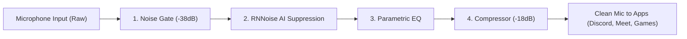

# 🎙️ Audio & Headset Microphone Setup Guide (บันทึกการแก้ปัญหาไมค์หูฟังเสียงสะท้อน)

คู่มือและบันทึกการแก้ปัญหาเสียงไมโครโฟนหูฟังสะท้อน (Microphone Echo, Bleed, Crosstalk, Feedback Loop) บน Arch Linux / CachyOS พร้อม PipeWire และ EasyEffects

---

## 🔍 สาเหตุของปัญหา (Root Causes)

1. **3.5mm Combo Jack Crosstalk & Bleed:**
   * ช่องเสียบหูฟังแบบ 3.5mm TRRS (Combo Jack) บนแล็ปท็อป (เช่น HP Victus, Realtek ALC series) มักมีปัญหาสัญญาณ Output (เสียงลำโพง/เพลงในหูฟัง) รั่วข้ามช่องสัญญาณ (Hardware Bleed) เข้าไปยังวงจร Input ของไมโครโฟน
2. **ALSA 'Mic Boost' Gain สูงเกินไป:**
   * ไดรเวอร์ ALSA มักตั้งค่า `Mic Boost` ไว้ที่ระดับสูงสุด (ระดับ 2 หรือ 3 / 100%) ทำให้ไมโครโฟนมีค่า Sensitivity ไวเกินไปจนดูดเสียงที่เล็ดลอดจากฟองน้ำหูฟังกลับเข้าไป จนเกิดเสียงก้องสะท้อน (Echo Loop) หรือเสียงหวีดหอน (Acoustic Feedback)
3. **ขาด Noise Gate & Acoustic Echo Suppression:**
   * หากไม่มีการตัดสัญญาณช่วงที่ไม่ได้พูด เสียงเพื่อนในห้องประชุมหรือเสียงเกมจะหลุดเข้าไปในไมค์อย่างต่อเนื่อง

---

## 🛠️ วิธีการแก้ปัญหาที่นำมาใช้ใน Dotfiles

### 1. ควบคุม ALSA Mic Boost อัตโนมัติ (`hyprland.lua`)
ใน `.config/hypr/hyprland.lua` มีการรันคำสั่งล็อกค่า `Mic Boost` ให้อยู่ในระดับที่เหมาะสม (ระดับ 1) ตอนเปิดเครื่องและ Reload:

```lua
hl.exec_cmd("for c in 0 1 2 3; do amixer -c $c sset 'Mic Boost' 1 2>/dev/null; done || true")
```

* **ผลลัพธ์:** ลด Noise floor และหยุดการรับสัญญาณ Crosstalk จากช่องหูฟัง แต่ยังคงระดับเสียงพูดที่ชัดเจน

---

### 2. EasyEffects Processing Pipeline (`.config/easyeffects/`)
Dotfiles ได้บันทึกการตั้งค่า Pipeline สำหรับไมโครโฟนไว้ใน `.config/easyeffects/db/` ทำงานใน Service Mode (`easyeffects --service-mode`):



| ปลั๊กอิน | การตั้งค่าสำคัญ | หน้าที่แก้ปัญหา |
| :--- | :--- | :--- |
| **Noise Gate (`gaterc`)** | Threshold: `-38 dB`, Reduction: `-25 dB`, Release: `150 ms` | **ตัดเสียงทันทีที่ไม่ได้พูด** ทำให้เสียงเพลง/เสียงเกมในหูฟังไม่สามารถหลุดเข้าไมค์ได้ |
| **RNNoise (`rnnoiserc`)** | VAD Threshold: `60%`, Release: `100 ms` | ใช้ AI ตัดเสียงพัดลม, เสียงคีย์บอร์ด, และเสียงสะท้อนที่แว่วเข้ามา |
| **Equalizer (`equalizerrc`)** | Custom Gain Bands | Cut ความถี่ต่ำที่ไม่จำเป็น และ Boost ความถี่เสียงพูดให้ใสชัดเจน |
| **Compressor (`compressorrc`)** | Threshold: `-18 dB`, Ratio: `3.1:1`, Attack: `15 ms` | ป้องกันเสียง Peak/แตกเมื่อพูดเสียงดัง |

---

### 3. การสลับอุปกรณ์เสียงผ่าน `audio-switch`
* ใช้สคริปต์ `audio-switch` (คีย์ลัด `SUPER + F10`) ในการเลือก Output/Input อย่างชัดเจน ป้องกันปัญหา PipeWire สลับไปเลือก Loopback Source โดยไม่ตั้งใจ

---

## 💡 คำสั่งและวิธีตรวจสอบเมื่อพบปัญหา

### เช็คระดับ Mic Boost ใน ALSA:
```bash
# ดูการตั้งค่า Mic Boost
amixer -c 0 sget 'Mic Boost' 2>/dev/null || amixer sget 'Mic Boost' 2>/dev/null

# ปรับให้อยู่ระดับ 1 (ปลอดภัยจากเสียงสะท้อน)
for c in 0 1 2 3; do amixer -c $c sset 'Mic Boost' 1 2>/dev/null; done
```

### เช็คสถานะ EasyEffects:
```bash
# ตรวจสอบว่า EasyEffects ทำงานอยู่หรือไม่
pgrep -a easyeffects

# รีสตาร์ต EasyEffects Daemon
killall easyeffects && easyeffects --service-mode &
```

### เปิดใช้งาน PipeWire WebRTC Echo-Cancel (ทางเลือกเพิ่มเติม):
หากต้องการเปิด Acoustic Echo Cancellation (AEC) ระดับระบบ สามารถโหลดโมดูล PipeWire ได้ชั่วคราว:
```bash
pw-cli load-node libpipewire-module-echo-cancel
```
หรือสร้างไฟล์คอนฟิก `~/.config/pipewire/pipewire.conf.d/echo-cancel.conf`:
```spa
context.modules = [
    { name = libpipewire-module-echo-cancel
      args = {
          aec.method = webrtc
          source.props = {
              node.name = "Echo-Cancellation-Source"
              node.description = "Microphone (Echo-Free)"
          }
      }
    }
]
```
