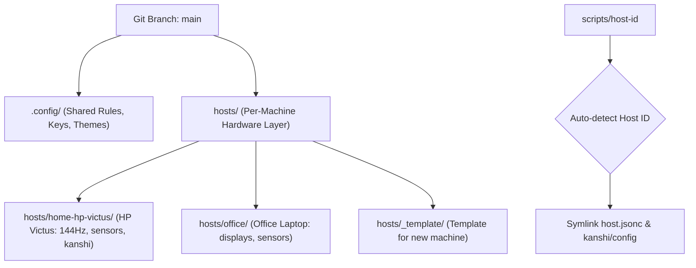

# 🛠️ Dotfiles Tooling & Architecture Guide

คู่มือสรุปรายการเครื่องมือ (Tools), สถาปัตยกรรม (Architecture), และเหตุผลในการเลือกใช้แต่ละส่วนประกอบใน **Tanakorn's Personal Dotfiles & Hyprland Setup**

---

## 🧭 ปรัชญาการออกแบบ (Design Philosophy)

* **Performance & Low Latency:** เลือกใช้เครื่องมือที่คอมไพล์ด้วย Rust/C/C++ ทำงานเร็ว ไม่หน่วง กินแรมน้อย
* **Wayland-Native:** ทุกแอปพลิเคชันและยูทิลิตีทำงานบน Wayland โดยตรง (ไม่พึ่งพา XWayland โดยไม่จำเป็น)
* **Reproducible & Self-Healing:** มีระบบตรวจเช็คตัวเอง (`dotfiles-doctor`), ลินท์โค้ดอัตโนมัติ (`lint.sh`), และตัวติดตั้งคำสั่งเดียว (`install.sh --all`)
* **Multi-Machine Single Branch:** รองรับหลายเครื่อง (บ้าน/ออฟฟิศ) บน Git branch `main` เดียวกันผ่าน Host Layers

---

## 📑 สรุปเครื่องมือแยกตามหมวดหมู่

### 1. 🖥️ Window Management & Display

| เครื่องมือ | หน้าที่ (Role) | ทำไมถึงเลือกใช้ / เหตุผล (Why & Rationale) |
| :--- | :--- | :--- |
| **Hyprland** (`hyprland.lua`) | Wayland Tiling Compositor | ตัวจัดการหน้าต่างหลัก มีความลื่นไหลสูง แอนิเมชันสวยงาม ปรับแต่งได้ละเอียด และใช้ Lua config แทนไฟล์ config ธรรมดา ช่วยให้เขียน logic, loop, และเงื่อนไขต่าง ๆ ได้ยืดหยุ่น |
| **Kanshi** | Monitor Profile Autodetect | ตรวจจับและสลับ Layout จอแสดงผลอัตโนมัติ (เช่น จอโน้ตบุ๊กเดี่ยว ⇄ จอต่อพ่วงในห้องทำงาน) โดยไม่ต้องกดตั้งค่าใหม่ทุกครั้งที่เสียบ Dock |
| **GloView** | Overview / Window Exposé | Plugin เสริมของ Hyprland เพื่อดูภาพรวมของหน้าต่างทั้งหมดใน Workspace เหมือนใน macOS Mission Control |
| **Waypaper + Awww** | Wallpaper Manager | Waypaper เป็น GUI เลือกภาพพื้นหลังที่ใช้งานง่าย และ Awww (swww backend) มี Transition สลับภาพที่นุ่มนวลและไม่กระตุก |

---

### 2. 📊 Status Bar & Menus

| เครื่องมือ | หน้าที่ (Role) | ทำไมถึงเลือกใช้ / เหตุผล (Why & Rationale) |
| :--- | :--- | :--- |
| **Waybar** | Status Bar | ปรับแต่ง Layout ได้ละเอียดผ่าน JSONC และตกแต่งความสวยงามด้วย CSS พร้อม Dark/Light theme palette |
| **Waybar Watchdog** (`scripts/waybar`) | ตัวคุมความเสถียรของ Bar | เสริม `flock` ป้องกันเปิด Waybar ซ้อน และมีระบบ Crash recovery สปอว์นบาร์ใหม่ทันทีหาก mpris/playerctl ทำบาร์แครช |
| **Fuzzel** | Application Launcher & Menu | เมนูคำสั่งแบบ dmenu สำหรับ Wayland โดยเฉพาะ เร็วมาก สตาร์ตทันที ใช้เป็นแกนกลางสร้างเมนูเลือกเน็ตเวิร์ก, เสียง, และ Power menu |
| **Quickshell** (`shell.qml`) | Hotkeys Cheat Sheet Overlay | เมนู QML แสดงรายการคีย์ลัดของทั้งระบบ (`SUPER + ?`) สวยงาม ทันสมัย และช่วยเตือนความจำคีย์ลัด |
| **Nwg-drawer** | Application Grid Drawer | เมนูเปิดแอปพลิเคชันแบบเต็มหน้าจอ สำหรับเวลาที่ต้องการค้นหาแบบไอคอน |

---

### 3. 🎙️ Audio & Voice Processing

| เครื่องมือ | หน้าที่ (Role) | ทำไมถึงเลือกใช้ / เหตุผล (Why & Rationale) |
| :--- | :--- | :--- |
| **PipeWire + WirePlumber** | Modern Audio Server | Low-latency audio server ทดแทน PulseAudio/JACK รองรับการ Route ช่องสัญญาณเสียงอย่างอิสระ |
| **EasyEffects** (v8) | Realtime DSP Audio Pipeline | จัดการตัดเสียงรบกวนและแก้ปัญหาเสียงสะท้อนไมค์หูฟัง 3.5mm ด้วย Noise Gate (`-38dB`), RNNoise AI, EQ และ Compressor (ดูรายละเอียดใน [`AUDIO.md`](AUDIO.md)) |
| **ALSA Mic Boost Guard** | Script ล็อกเกน Mic Boost = 1 | ล็อกเกนผ่าน `amixer` ใน `hyprland.lua` เพื่อป้องกันไม่ให้ไมค์ไวเกินไปจนดูดเสียงจากฟองน้ำหูฟังกลับเข้าไป |
| **`audio-switch`** | Quick Audio Switcher (`SUPER + F10`) | สลับ Output/Input (หูฟัง/ลำโพง/ไมค์) ผ่าน Fuzzel พร้อมบอกระดับเสียงและสถานะ Mute ในคลิกเดียว |

---

### 4. ⚡ Power, Battery & Hardware

| เครื่องมือ | หน้าที่ (Role) | ทำไมถึงเลือกใช้ / เหตุผล (Why & Rationale) |
| :--- | :--- | :--- |
| **`battery-saver`** | Battery Policy Daemon | ตรวจจับการเสียบปลั๊กไฟอัตโนมัติ: เสียบปลั๊กใช้ Profile `balanced`, ถอดปลั๊กสลับเป็น `power-saver`, แบต ≤ 20% แจ้งเตือน และมีคีย์ลัด `CTRL + SUPER + B` |
| **`waybar-fan`** | Power Profile & Fan Controller | รองรับเซนเซอร์หลากหลาย (HP Victus, Generic hwmon, MSI EC) แสดงรอบ RPM/อุณหภูมิ และคลิกสลับโปรไฟล์ความแรงพัดลมได้ |
| **power-profiles-daemon** | Kernel CPU Scaling Interface | ตัวกลางปรับ Energy Performance Preference (EPP) ให้เคอร์เนลจัดการ CPU TDP ตามโหมดที่เลือก |

---

### 5. 💻 Terminal & Shell

| เครื่องมือ | หน้าที่ (Role) | ทำไมถึงเลือกใช้ / เหตุผล (Why & Rationale) |
| :--- | :--- | :--- |
| **Kitty** | GPU-Accelerated Terminal | รองรับ TrueColor, Font Ligatures, และ Kitty Graphics Protocol เปิดรูปภาพในเทอร์มินัลได้ทันที |
| **Zsh + Oh-My-Zsh / Fish** | Interactive Shells | มี Plugin ซิงค์ประวัติ, เติมคำสั่งอัตโนมัติ (Autosuggestions) และไฮไลต์ไวยากรณ์ (Syntax Highlighting) |
| **Starship** | Fast Shell Prompt (Rust) | เร็ว โหลดข้อมูล Git branch, สถานะ repo, และเวอร์ชันภาษา (Node, Python, Go, Rust) โดยไม่ทำให้เทอร์มินัลช้า |
| **Atuin** | Encrypted Shell History (SQLite) | ค้นหาคำสั่งเก่าที่เคยพิมพ์ด้วย Fuzzy search แบบเต็มหน้าจอ (กด `Ctrl + R` หรือ `Up`) |

---

### 6. 🛠️ Development & Productivity

| เครื่องมือ | หน้าที่ (Role) | ทำไมถึงเลือกใช้ / เหตุผล (Why & Rationale) |
| :--- | :--- | :--- |
| **Zed** | Next-Gen Code Editor (Rust) | Editor ความเร็วสูง โหลดไฟล์ใหญ่ได้ทันที พร้อม Global tasks สำหรับรัน dev/test |
| **Yazi** | TUI File Manager (Rust) | จัดการไฟล์ผ่านคีย์บอร์ดอย่างรวดเร็ว รองรับการ Preview รูปภาพและโค้ด |
| **Btop** | System Resource Monitor | หน้าต่างแสดงกราฟการใช้งาน CPU, GPU, RAM, Disk และ Process แบบ Realtime |
| **`smart-snip`** | Smart Screenshot | คลิกซ้ายครอปลง Clipboard ทันที / คลิกขวาเปิด Swappy เพื่อวาด ปากกา เน้นข้อความ |
| **`ocr-snip`** | Text Recognition (OCR) | ลากแคปข้อความภาษาไทยและอังกฤษ แปลงเป็นตัวอักษรลง Clipboard ทันทีผ่าน Tesseract |
| **Cliphist + wl-clipboard** | Clipboard History Manager | เก็บประวัติข้อความและรูปภาพที่เคย Copy เรียกดูและวางซ้ำได้ง่าย |
| **`theme-switcher`** | Color theme picker | เลือกชุดสีทั้งระบบ (Rumda / Tide / Ember / Moss × Dark/Light) ผ่าน Fuzzel — ไม่มี daemon ค้าง |

---

## 🏗️ สถาปัตยกรรมระบบ Multi-Machine (`hosts/`)



* **แยกส่วนที่ขึ้นกับฮาร์ดแวร์:** ชื่อจอ, ค่า Refresh rate, path ของเซนเซอร์พัดลม, และ Kanshi profiles ถูกเก็บไว้ที่ `hosts/<id>/`
* **แชร์คอนฟิกกลาง:** Logic การทำงาน, คีย์ลัด, ธีม, สคริปต์ และ Pipeline ทั้งหมดอยู่ที่ `.config/` และ `scripts/`
* **บำรุงรักษาง่าย:** เมื่อปรับปรุงฟีเจอร์ใหม่ แค่ `git push` และ `git pull` ทุกเครื่องจะได้รับอัปเดตทันทีโดยไม่มี Git conflict เรื่องชื่อจอ

---

## 🩺 การตรวจสอบและบำรุงรักษา (Self-Healing)

```bash
dotfiles-doctor    # ตรวจเช็คคำสั่ง, Symlinks และ Syntax ทั้งระบบ (54 checks)
./scripts/lint.sh  # ตรวจสอบโค้ด Shell, Lua, JSONC, YAML, Python
./install.sh link  # ซิงค์และกู้คืน Symlinks ที่ขาดหายไปอัตโนมัติ
```
